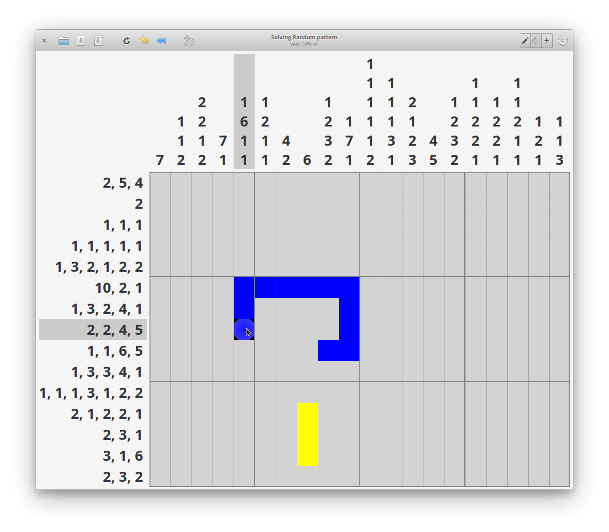

#  Gnonograms
Nonogram puzzle game written in Vala/Gtk and intended primarily for elementaryos.

[](http://www.gnu.org/licenses/gpl-3.0)



### Building
```
meson build --prefix=/usr  --buildtype=release
cd build
ninja
```

### Installing & executing
```
sudo ninja install
com.github.jeremy.gnonograms
```

### Uninstalling
```
In original build directory:

sudo ninja uninstall
sudo ./post_uninstall.py
```
